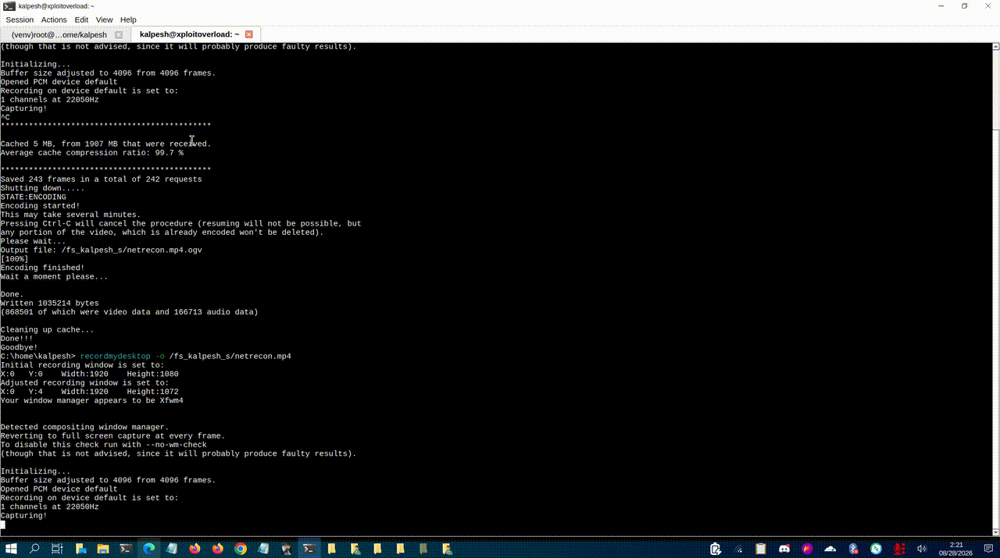

> "Every network tells a story. NetRecon helps you read it."

## NetRecon: Local Network Reconnaissance

**NetRecon** is a Python-based network reconnaissance tool built from scratch for discovering and monitoring devices on local networks.

It provides active ARP scanning, passive ARP sniffing, an interactive terminal interface, live host monitoring, TCP port scanning, MAC vendor lookup, known-host labeling, and JSON/CSV export.

Built for **visibility, control, and straightforward network reconnaissance**.

---

### Operator

* **Kalpesh Solanki**
* Contact: [hello@cx330.in](mailto:hello@cx330.in)
---

<p align="center">
  
</p>

## Why This Exists

NetRecon was built to provide a simple and practical way to discover and monitor devices on a local network.

**See what is connected. Know what is happening.**

---

## Installation

### Requirements

* Python 3
* Linux
* libpcap
* Root privileges for active scanning

### Install dependencies

```bash
sudo apt update
sudo apt install python3-pip python3-venv libpcap-dev tcpdump
```

### Setup

```bash
git clone https://github.com/xploitoverload/NetRecon.git
cd NetRecon

python3 -m venv venv
source venv/bin/activate

python -m pip install --upgrade pip
python -m pip install scapy netifaces rich
```

### Verify

```bash
python -c "import scapy, netifaces, rich; print('Dependencies OK')"
```

---

## Usage

### Basic scan

```bash
sudo python3 netrecon.py
```

### Scan a specific network

```bash
sudo python3 netrecon.py -i wlan0 -r 192.168.0.0/24
```

### Passive mode

```bash
sudo python3 netrecon.py -i wlan0 -p
```

### Fast scan

```bash
sudo python3 netrecon.py -i wlan0 -r 192.168.0.0/24 -f
```

### Live monitoring

```bash
sudo python3 netrecon.py --live --interval 10
```

### TCP port scanning

```bash
sudo python3 netrecon.py -i wlan0 -r 192.168.0.0/24 --ports
```

### JSON export

```bash
sudo python3 netrecon.py -r 192.168.0.0/24 --json results.json
```

### CSV export

```bash
sudo python3 netrecon.py -r 192.168.0.0/24 --csv results.csv
```

### Parsable output

```bash
sudo python3 netrecon.py -r 192.168.0.0/24 -P
```

---

## Options

```text
-i, --iface IFACE       Network interface
-r, --range CIDR        Network range to scan
-l, --list FILE         File containing CIDR ranges
-p, --passive           Passive ARP sniffing
-m, --macs FILE         Known MAC addresses
-F, --filter EXPR       Custom pcap filter
-f, --fast              Fast scan
-c, --count N            ARP request count
-s, --sleep MS           Delay between requests
-n, --node OCTET         Source IP last octet
-P, --parsable           Parsable output
-L, --listen             Continue listening
-N, --no-header          Suppress output header
-R, --no-root            Skip root check

--live                   Live device monitoring
--interval SEC           Live scan interval
--ports                  TCP port scanning
--json FILE              JSON export
--csv FILE               CSV export
--verbose                Verbose output
--timeout SEC            ARP timeout
```

---

## Interactive Keys

```text
u       Unique hosts
a       ARP replies
r       ARP requests
j / ↓   Scroll down
k / ↑   Scroll up
.       Page down
,       Page up
h       Help
q       Quit
```

---

## Security

Use NetRecon only on networks and devices you own or are explicitly authorized to test.

Active ARP scanning and TCP port scanning generate network traffic and may trigger network monitoring or security systems.
